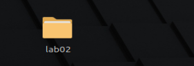
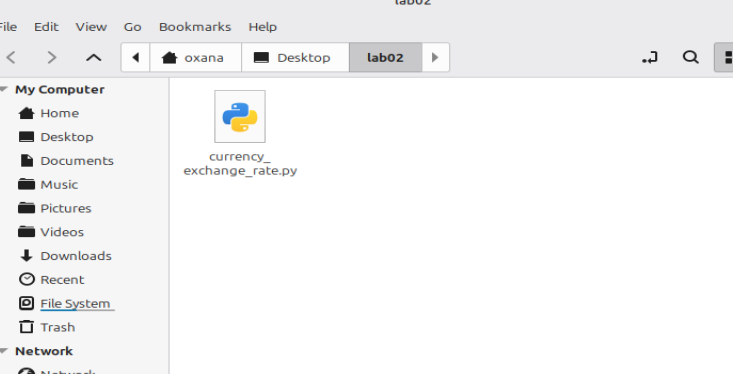
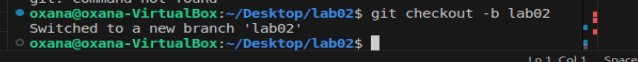
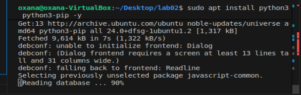
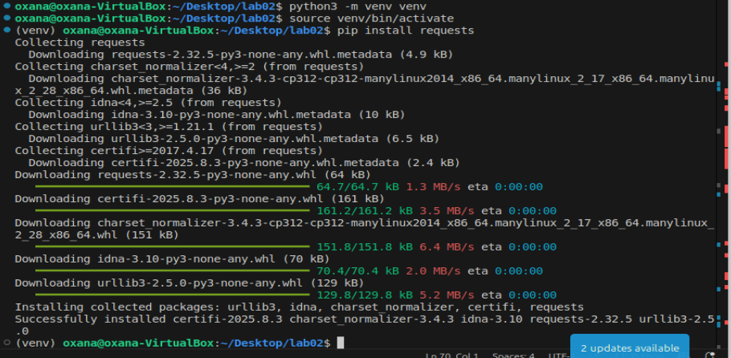
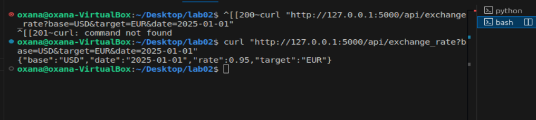
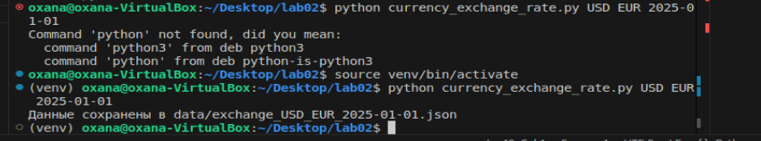
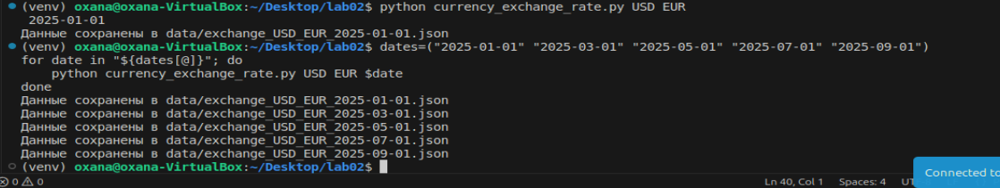

# Лабораторная работа 2 - Creating a Python Script to Interact with an API

## Описание проекта
Этот проект является поддержкой для лабораторной работы `lab02` и представляет собой сервис **Currency Exchange Rate**.

- Базовая валюта: `MDL` 
- Доступные валюты: `USD`, `EUR`, `RON`, `RUS`, `UAH`
- Данные валютных курсов действительны с `2025-01-01` по `2025-09-15`

### Состав проекта
```
├─ LAB02/
│   └─ currency_exchange_rate.py   #Скрипт для получения курса валют через локальный API
├─ app.py                          #Локальный сервер API (Flask)
├─ data/                           #Папка для хранения JSON с курсами валют
├─ error.log                       #Лог ошибок
├─ venv/                           #Виртуальное окружение (без пакетов)
├─ README.md                       #Полная инструкция по запуску и использованию
├─ run_all.sh                      #Bash-скрипт для тестирования на нескольких датах
```

---

## Установка и запуск проекта

1. Перейдите в корень проекта:
```bash
cd ~/Desktop/LAB02
```







2. Создайте виртуальное окружение и активируйте его:
```bash
python3 -m venv venv
source venv/bin/activate
```



3. Установите необходимые зависимости:
```bash
pip install requests flask
```


### Запуск локального сервера
```bash
python app.py
```
Проверка работы сервера через curl:
```bash
curl "http://127.0.0.1:5000/api/exchange_rate?base=USD&target=EUR&date=2025-01-01"
```
Пример ответа:
```json
{
  "base": "USD",
  "target": "EUR",
  "date": "2025-01-01",
  "rate": 0.95
}
```

### Использование скрипта currency_exchange_rate.py
```bash
python lab02/currency_exchange_rate.py <BASE_CURRENCY> <TARGET_CURRENCY> <DATE>
```
Пример:
```bash
python lab02/currency_exchange_rate.py USD EUR 2025-01-01
```

Файл JSON создаётся в папке `data/`:
```
data/exchange_USD_EUR_2025-01-01.json
```


### Тестирование на нескольких датах
```bash
dates=("2025-01-01" "2025-03-01" "2025-05-01" "2025-07-01" "2025-09-01")
for date in "${dates[@]}"; do
    python lab02/currency_exchange_rate.py USD EUR $date
done
```
Или через `run_all.sh`:
```bash
chmod +x run_all.sh
./run_all.sh
```
Все JSON файлы будут сохранены в папке `data/`.



### Обработка ошибок
- Неверная дата или валюта выводится в терминале и сохраняется в `error.log`:
```bash
python LAB02/currency_exchange_rate.py USD ABC 2025-01-01
```
Результат:
```
Ошибка запроса к API: Курс USD -> ABC недоступен
```

### Проверка доступных валют через API
Список доступных валют можно получить через endpoint локального сервера:
```bash
curl "http://127.0.0.1:5000/api/currencies"
```

Ответ:

```json
{"currencies":["MDL","USD","EUR","RON","RUS","UAH"]}
```

---

## 1. Как установить необходимые зависимости для запуска скрипта

Используются Python и следующие внешние библиотеки:

* `requests` — для отправки HTTP-запросов к API
* `flask` — для локального сервера (API)

**Пошаговая установка:**

1. Перейдите в корень проекта:

```bash
cd ~/Desktop/lab02_project
```

2. Создайте и активируйте виртуальное окружение (рекомендуется для изоляции зависимостей):

```bash
python3 -m venv venv
source venv/bin/activate
```

3. Установите зависимости:

```bash
pip install requests flask
```

---

## 2. Как запускать скрипт с примерами команд

Скрипт принимает три аргумента:

```
python lab02/currency_exchange_rate.py <BASE_CURRENCY> <TARGET_CURRENCY> <DATE>
```

* `<BASE_CURRENCY>` — валюта, из которой конвертируем (например, USD)
* `<TARGET_CURRENCY>` — валюта, в которую конвертируем (например, EUR)
* `<DATE>` — дата в формате `YYYY-MM-DD`

**Примеры:**

```bash
python lab02/currency_exchange_rate.py USD EUR 2025-01-01
python lab02/currency_exchange_rate.py EUR JPY 2025-03-01
```

Результат — JSON-файл с курсом валют, сохранённый в папке `data/`:

```
data/exchange_USD_EUR_2025-01-01.json
```

**Запуск сразу для нескольких дат через bash-скрипт:**

```bash
chmod +x run_all.sh
./run_all.sh
```

Все файлы JSON будут сохранены в папке `data/`.

---

## 3. Как устроен скрипт (основные функции и логика)

**Файл:** `currency_exchange_rate.py`

**Основные шаги скрипта:**

1. **Получение аргументов командной строки:**

   * Валюта источника (`base`)
   * Валюта назначения (`target`)
   * Дата (`date`)

2. **Валидация аргументов:**

   * Проверка формата даты
   * Проверка доступных валют

3. **Отправка запроса к локальному серверу API:**

   * URL: `/api/exchange_rate?base=USD&target=EUR&date=YYYY-MM-DD`
   * Используется библиотека `requests`

4. **Обработка ответа:**

   * Если запрос успешен, данные сохраняются в JSON-файл в `data/`
   * Если возникает ошибка, выводится сообщение и сохраняется в `error.log`

5. **Сохранение данных:**

   * Имя файла: `exchange_<BASE>_<TARGET>_<DATE>.json`
   * JSON содержит: `base`, `target`, `date`, `rate`

**Пример логики внутри скрипта:**

```python
import requests
import json
import os
import sys

base = sys.argv[1]
target = sys.argv[2]
date = sys.argv[3]

url = f"http://127.0.0.1:5000/api/exchange_rate?base={base}&target={target}&date={date}"
response = requests.get(url)
data = response.json()

os.makedirs("data", exist_ok=True)
filename = f"data/exchange_{base}_{target}_{date}.json"
with open(filename, "w") as f:
    json.dump(data, f, indent=4)
print(f"Данные сохранены в {filename}")
```

---

## Итоги

- Скрипт получает курс валют с локального API.
- Данные сохраняются в JSON.`
- Ошибки обрабатываются и логируются.
- Тестирование возможно на нескольких датах через цикл или Bash-скрипт.
- Виртуальное окружение обеспечивает безопасную работу проекта.
- Проект полностью соответствует лабораторной работе и готов к сдаче.

